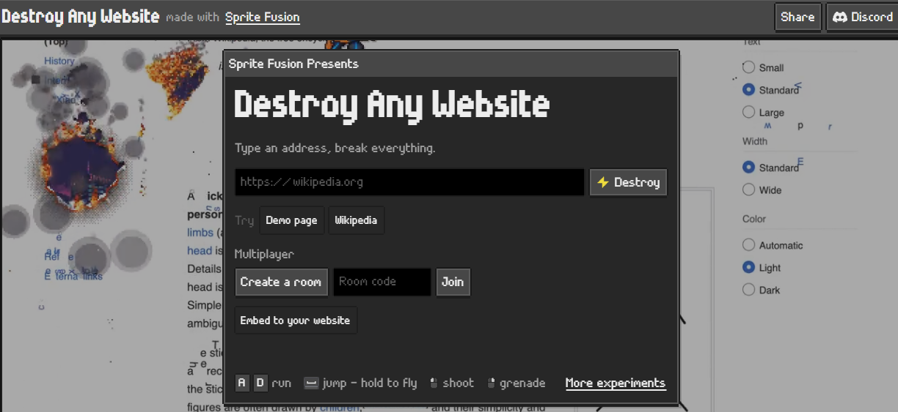

# How to Play?
A map for [destroy.spritefusion.com](https://destroy.spritefusion.com)

### You have to __COPY__ this link first:
```html
playerone-bit.github.io/shooter
```
### then __PASTE__ it here:


### If you want to add a template platform copy this:
```html
<div class="platform" style="
        top: ___px;
        bottom: ___px;
        left: ___px;
        right: ___px;
    "></div>
```


## index.html
```html
<!DOCTYPE html>
<html lang="en">
<head>
    <meta charset="UTF-8">
    <meta name="viewport" content="width=device-width, initial-scale=1.0">
    <title>Shooter Game</title>
    <style>
        * {
            box-sizing: border-box;
        }
        html, body {
            margin: 0;
            width: 100%;
            height: 500vh;
            overflow: hidden;
            background: #111;
        }
        .wall-left {
            position: absolute;
            top: 0;
            left: 0;
            width: 20px;
            height: 100%;
            background: #333;
        }
        .wall-right {
            position: absolute;
            top: 0;
            right: 0;
            width: 20px;
            height: 100%;
            background: #333;
        }
        .platform {
            position: absolute;
            width: 200px;
            height: 20px;
            background: #555;
        }
        .ground {
            position: absolute;
            bottom: 0;
            left: 0;
            width: 100%;
            height: 100px;
            background: #555;
        }
    </style>
</head>

<body>
    <div class="wall-left"></div>
    <div class="wall-right"></div>
    <div class="ground"></div>
    <!-- Insert your platform templates here-->
</body>
</html>
```